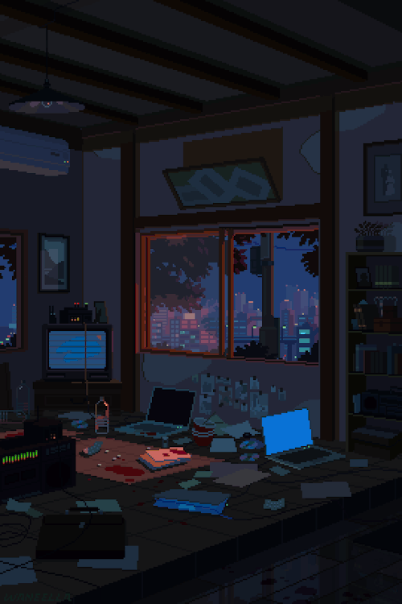

<div align="center">


</div>

<div align="center">


</div>

<br>

<div align="center">


</div>

---

```ts
const henrique = {
  role: "Full Stack Development Student",
  education: "DSM - Fatec",
  currentlyLearning: [
    "React",
    "TypeScript",
    "Python",
    "Docker"
  ],
  technologies: [
    "JavaScript",
    "Express",
    "PostgreSQL",
    "Git"
  ],
  interests: [
    "Web Development",
    "Open Source",
  ],
};
```

---

<table width="100%">
<tr>
<td width="65%" valign="top">

<h4>Connect with Me</h4>

<a href="https://github.com/Henri-Bueno">

</a>

<h4>⚡ My Stack</h4>


</td>

<td width="35%" align="center" valign="middle">



</td>
</tr>
</table>

---

# 📊 GitHub Stats

<div align="center">


</div>

---

<div align="center">

<a href="https://github.com/Henri-Bueno/github-readme-stats">

</a>

<a href="https://github.com/Henri-Bueno/github-readme-stats">

</a>

</div>

---

<div align="center">


</div>

---

<picture align="center">
  <source media="(prefers-color-scheme: dark)" srcset="https://raw.githubusercontent.com/Henri-Bueno/Henri-Bueno/output/github-contribution-grid-snake-dark.svg">
  <source media="(prefers-color-scheme: light)" srcset="https://raw.githubusercontent.com/Henri-Bueno/Henri-Bueno/output/github-contribution-grid-snake.svg">
  
</picture>
